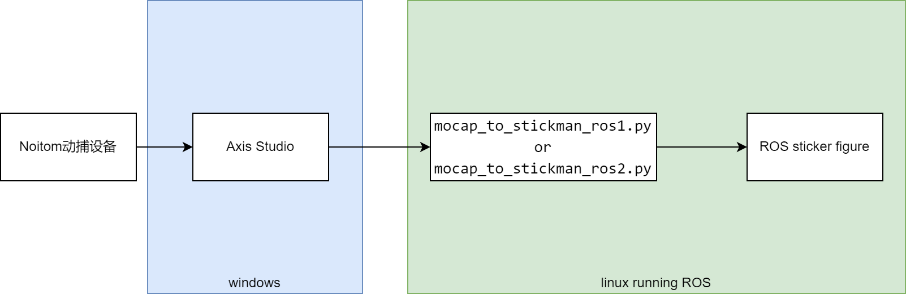
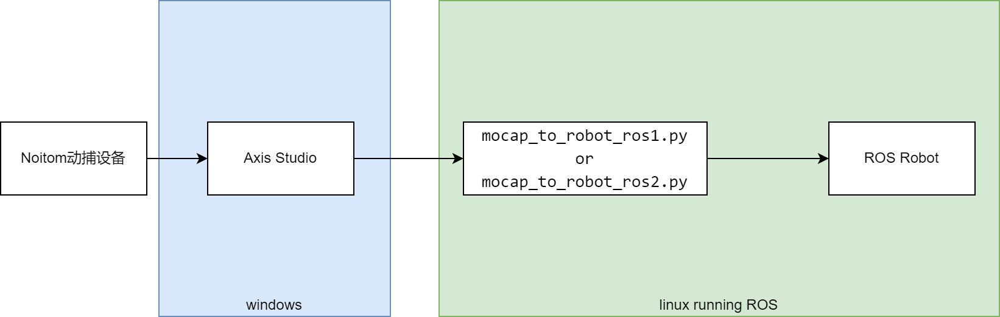
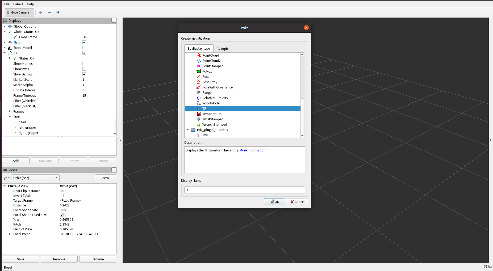
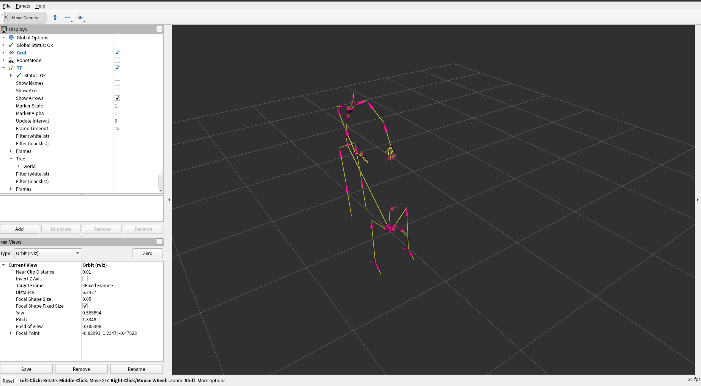

# Quick start guide

本工程将向你展示如何使用Noitom的动捕软件 Axis Studio 获取的动作捕捉数据，驱动人形机器人或ROS的火柴人的功能，支持ROS1和ROS2环境。

如果你是第一次接触动捕设备或ROS，下面的一些概念需要了解一下：

- 动捕设备：是一种可以捕捉人体运动的设备，Noitom公司的动捕设备是Perception Neuron Studio和Perception Neuron3 Pro系列产品。
- Axis Studio：是Noitom公司提供专业的动捕软件，它跟动捕设备进行通信，并提供可以用来录制、编辑、播放、传输动捕数据。
- BVH：是一种常用的动捕数据格式，它是一种人体骨骼动作数据格式，可以用来描述人体的骨骼动作。
- URDF：是一种常用的机器人描述语言，它是一种用来描述机器人模型的语言，可以用来描述机器人各个部件的形状、尺寸、关节等信息。
- ROS：是Robot Operating System，它是一个开源的机器人操作系统，可以用来驱动机器人，并提供通信、消息传递等功能。
- ROS1：是ROS的第一个版本，它是ROS的主要版本，目前ROS2已经成为主流版本。
- ROS2：是ROS的第二个版本，它是ROS的最新版本，它提供了更加灵活的通信机制，可以用来驱动机器人。

> 注意：诺亦腾除了Axis Studio软件，还提供PNLink（有线动捕产品）的上位机软件以及Alice（光学动捕产品）的上位机软件。这些软件均可以用来获取动捕数据，并对接ROS平台。为了方便演示，本工程只使用Axis Studio软件。

## 前提

- 一台Windows PC，已安装的Axis Studio软件
- 一台Linux PC，已安装ROS1或ROS2环境

## 目录结构

该工程使用python语言编写，演示了如何调用封装的robotapi库，从Axis Studio获取动捕数据，这些数据是人体的骨骼动作数据，以BVH格式存储。接下来，有两个选择：
1. 你可以自己解析BVH数据，并将其转换为你自己人形机器人的URDF格式，然后使用ROS1或ROS2驱动它。
2. 另外，我们也提供了一个机器人模型及其对应的URDF文件，你可以直接使用它来看到该机器人的动作效果。如果你需要适配你自己的机器人，可以直接联系我们（xxx@noitom.com）提供帮助。

针对选择1，为了确保数据的准确性，我们会演示如何把从axis studio获取的数据，驱动到ROS平台上的一个人体模型（火柴人），最终的效果是，在axis studio中录制的动作，在ros中的火柴人模型也会跟着动作运动。

在进入下面的步骤之前，我们先了解一下本工程的目录结构

| 条目                      | 说明                                                         |
| ------------------------- | ------------------------------------------------------------ |
| lib/                      | 包含了针对各个CPU架构的librobotapi动态库文件，它提供了接口函数，从Axis Studio获取动捕数据，同时也封装了从BVH数据转换为URDF格式的功能。 |
| img/                      | 包含了本说明文档中用到的图片                                 |
| urdfdemo_ros1/            | ROS1环境下，包含了用于驱动机器人模型的URDF文件，以及用于驱动机器人模型的launch文件。 |
| urdfdemo_ros2/            | ROS2环境下，包含了用于驱动机器人模型的URDF文件，以及用于驱动机器人模型的launch文件。 |
| README.md                 | 本说明文档                                                   |
| mocap_robotapi.py         | 封装了librobotapi库，从Axis Studio获取动捕数据，同时提供了BVH数据转换为符合URDF规范的json数据的功能。 |
| requirements_ros1.txt     | 针对ROS1环境，本工程依赖的python库。                         |
| requirements_ros2.txt     | 针对ROS2环境，本工程依赖的python库。                         |
| mocap_to_robot_ros1.py    | 针对ROS1环境，做为一个ros node，调用mocap_robotapi库，转换BVH数据为URDF格式的json数据，publish 数据类型（JointState）到 topic（/joint_states），以驱动机器人。 |
| mocap_to_robot_ros2.py    | 针对ROS2环境，功能与mocap_to_robot_ros1.py相同               |
| mocap_to_stickman_ros1.py | 针对ROS1环境，做为一个ros node，调用mocap_robotapi库，将原始BVH数据publish 数据类型（Joy）到 topic（/remoter/action_list），以驱动robot的火柴人模型。 |
| mocap_to_stickman_ros2.py | 针对ROS2环境，功能与mocap_to_stickman_ros1.py相同            |

## 架构与数据流

### 火柴人模型架构



### 机器人模型架构



## 步骤

1. 首先找一台windows PC，安装好Axis Studio软件，并做好配置。
2. 其次找一台linux PC，安装好ROS环境。（ROS1或ROS2都可以）
3. 根据ROS1还是ROS2环境，启动对应的ROS visualizer
4. 根据要驱动的模型是火柴人还是机器人，启动对应的ros node

详细步骤描述如下：

### 1. 下载安装本工程

登录安装了ROS的linux PC，下载本工程并安装依赖包。

```
cd ~
git clone https://github.com/pnmocap/mocap_ros.git
cd mocap_ros

pip3 install -r requirements_ros1.txt
or
pip3 install -r requirements_ros2.txt
```


### 2. Axis Studio 配置

最新一代的动作捕捉软件支持 Perception Neuron Studio 和 Perception Neuron3（Pro）动作捕捉产品。点击下方的 “[下载](https://shopcdn.noitom.com.cn/software/9d68e93a50424cac8fbc6d6c9e5bd3da/Axis_Studio_nacs_x64_2_12_13808_2521_20241209183103543.zip)” 按钮，获取软件安装包程序。

1. 启动*Axis Studio*, 打开一个动作数据文件

此时能看到Axis Studio里的3D模型在运动，如下图所示：

   [](https://github.com/pnmocap/neuron_mocap_live-c4d/blob/main/resource/launch_axis_studio.gif)


2. 使能 *BVH Broadcasting - Edit*, 配置如下图

   - Skeleton: **Axis Studio**
   - BVH Format - Rotation: **XYZ**
   - BVH Format - Displacement: **Checked**
   - Frame Format - Type: **Binary**
   - Frame Format - Use old header format: **Unchecked**
   - Protocol: **UDP**
   - Local Address: **192.168.2.40:7001**
   - Destination Address: **192.168.2.147:7012**

[](img/stream_04.png)

> BVH Format - Rotation: **默认是YXZ，请务必修改为XYZ**
> 其中的local address和destination address需要根据实际情况进行修改，请务必确保Local和Destination地址是同一个局域网的IP，**不要写成127.0.0.1，且目标端口是7012.**

### 3. 启动ROS Visualizer

无论驱动火柴人模型还是机器人模型，共用的同一套工作空间。

#### ROS1

1. 创建工作空间（仅第一次）

```
mkdir -p ~/catkin_noitom/src
cp urdfdemo_ros1 ~/catkin_noitom/src
cd ~/catkin_noitom/src
catkin_init_workspace
```

2. 编译并运行ROS visualizer

```
cd  ~/catkin_noitom
catkin_make
source  devel/setup.bash
roslaunch urdfdemo_ros1 view_robot.launch
```

#### ROS2

1. 创建工作空间（仅第一次）

```
mkdir -p ~/catkin_noitom
cp urdfdemo_ros2  ~/catkin_noitom
```

2. 编译并运行ros master

```
cd  ~/catkin_noitom/urdfdemo_ros2
colcon build
source  install/setup.bash
ros2  urdfdemo_ros2 view_robot.launch.py
```

#### 配置Visualizer（rviz）

1. 添加火柴人模型TF

启动ros visualizer，点击左边“Add”，在弹出的窗口选择“TF”，并点击OK。如下图：



2. 配置左侧菜单栏，确定显示/隐藏：机器人模型或火柴人模型，如下图：




### 4. 启动ROS Node

前提：

1. 请按照上述步骤配置好Axis Studio软件，使能BVH Broadcasting；
2. 启动ros visualizer，根据火柴人或机器人，确定显示/隐藏：TF还是机器人模型。

#### 驱动火柴人模型

```
cd path/to/mocap_ros
python mocap_to_stickman_ros1.py
or
python mocap_to_stickman_ros2.py
```

#### 驱动机器人模型

```
cd path/to/mocap_ros
python mocap_to_robot_ros1.py
or
python mocap_to_robot_ros2.py
```

