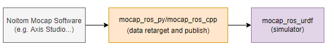
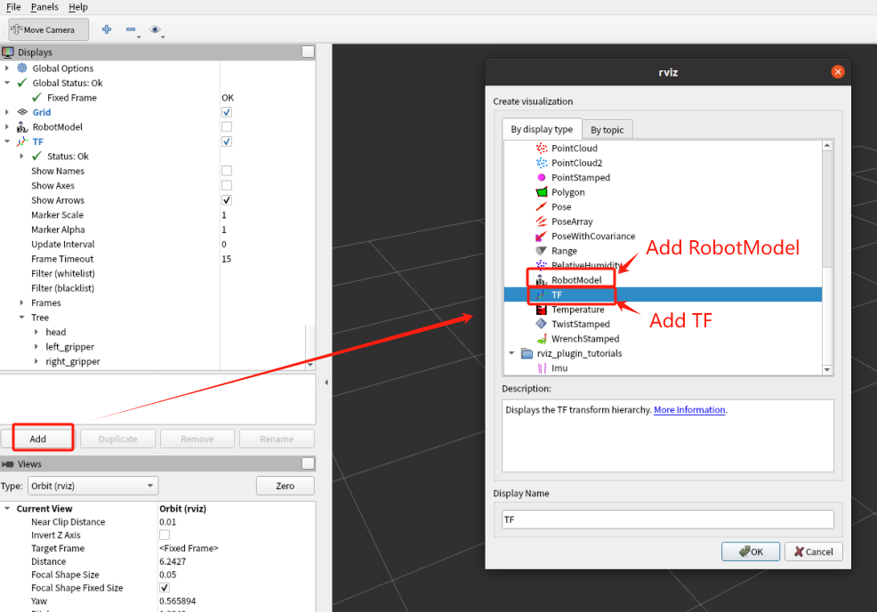
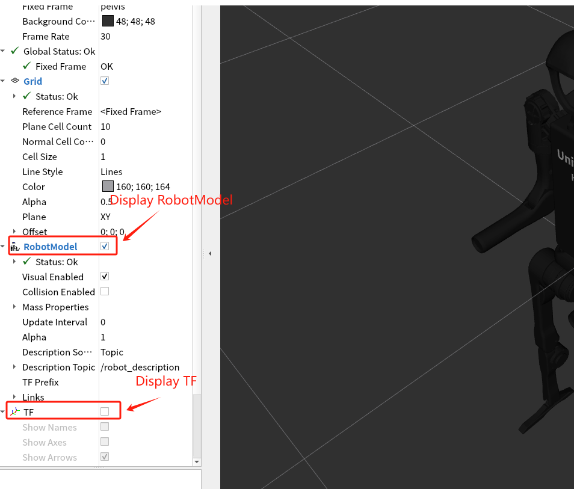

# Introduction

This project is a robot simulation emulator (RViz) node, which is used to listen for data and drive the model. Currently, it supports the H1 robot model from Unitree Technology.

When combined with the project of the data publishing node, it is possible to achieve the function of obtaining data from the motion capture software provided by Noitom Company and driving the robot.

The following figure shows the data flow of each component:



- **Noitom Mocap Software**: Noitom Company provides professional motion capture software (such as Axis Studio, Hybrid Data Server, etc.), which is responsible for providing motion capture data based on real human bodies.

  > please contact info@noitom.com

- **mocap_ros_py**: A ROS node program implemented in Python. It retrieves data from the Noitom Mocap Software. After retargeting, it sends the data to the simulator to drive the robot model. Alternatively, it can directly send the BVH data to drive the TF model(stickman). 

  > source code: https://github.com/pnmocap/mocap_ros_py.git

- **mocap_ros_cpp**: It has the same function as mocap_ros_py, but it is implemented in C++. 

  > source code: https://github.com/pnmocap/mocap_ros_cpp.git

- **mocap_ros_urdf**: This project, a robot simulation emulator, listens to the data from mocap_ros_py or mocap_ros_urdf and drives the robot.

  > source code:  https://github.com/pnmocap/mocap_ros_urdf.git

# Launch Steps
## Prerequisites
- A Linux PC with the ROS environment installed and configured (supporting ROS2).

## Instructions
- The ROS URDF demonstration model used here is h1.urdf (h1_with_hand.urdf is not supported for now).
- In RViz, the RobotModel and TF plugins need to be enabled.
- Before running for the first time, execute ```rosdep install``` to install the missing dependencies.


## ROS2

1. Create a workspace named `catkin_noitom` in the home directory.

> The following commands only need to be executed once.

```
mkdir -p ~/catkin_noitom
cp -r unitree_h1_ros2  ~/catkin_noitom
```

2. build and run ROS2 RViz

```
cd  ~/catkin_noitom/unitree_h1_ros2
colcon build
source install/setup.bash
ros2 launch unitree_h1_ros2 display.launch.py
```

 

## Configure the Model (TF or Robot)

- The TF(stickman) is a model mapped according to the real human skeleton. It doesn't require retargeting and can be driven by BVH data. Running this model is usually used to verify the correctness of the original human body data.
- The robot is a model based on the URDF file (this project currently supports the H1 model of Unitree Technology). The data needs to go through retargeting for driving.

> When actually driving, choose one of the above two models.

### Add Models

After the simulator is launched, click the "Add" button on the left side. In the pop - up dialog box, select "RobotModel" (for the robot model) or "TF" (for the stickman model), as shown in the following figure:



### Display Models

In the left - hand menu bar of the simulator window, check the "RobotModel" checkbox or the "TF" checkbox. Then, the robot model and the stickman model will be displayed, as shown in the following figure:




  